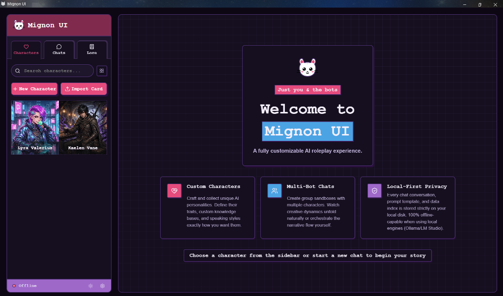
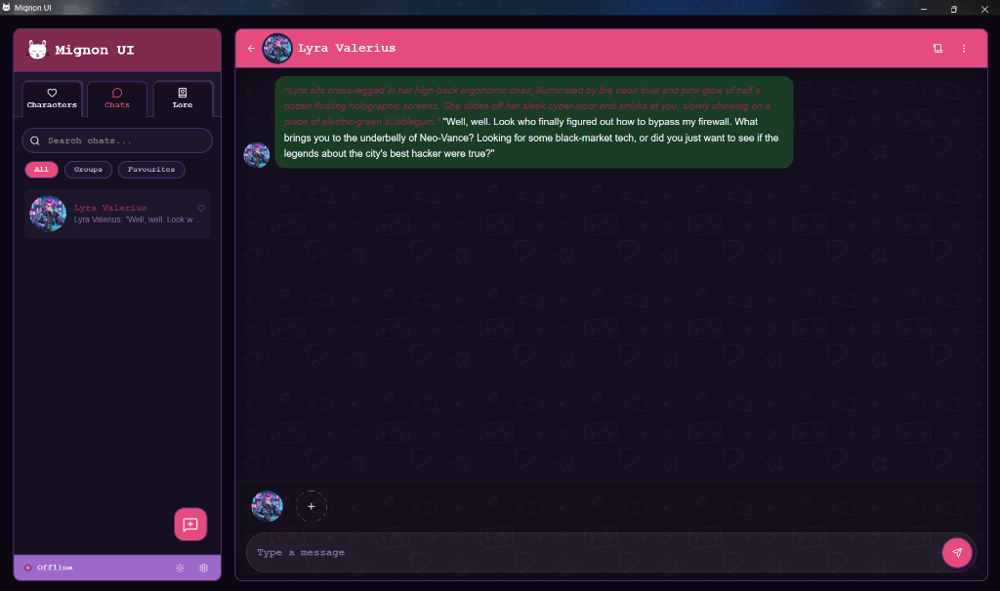
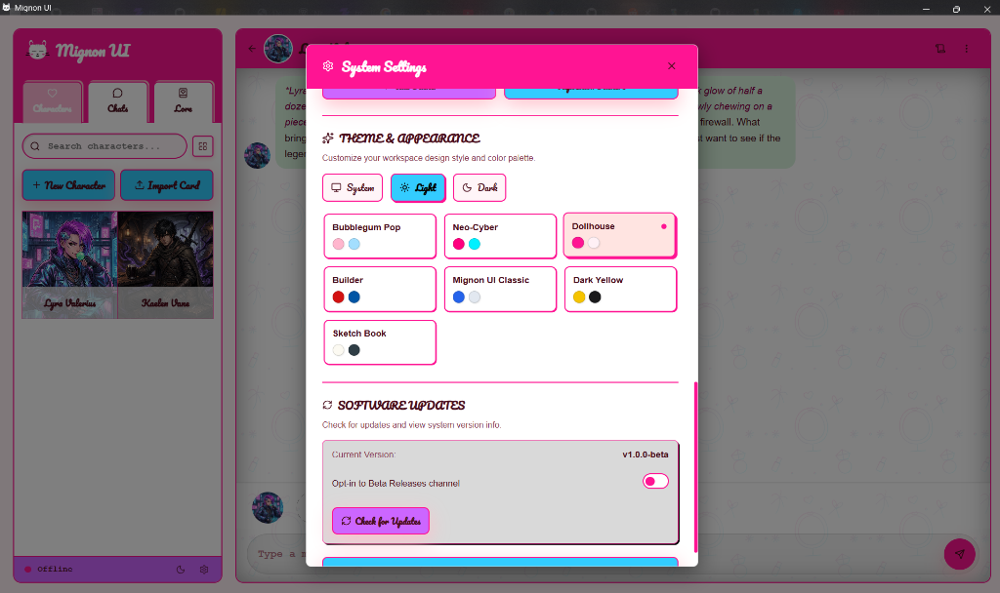
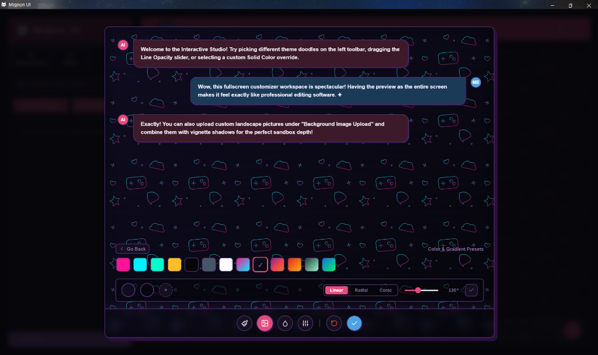
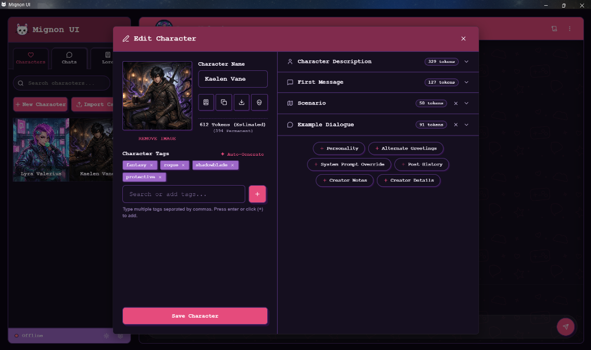

### Mignon UI

**The Local AI Roleplay Frontend Client.**<br/>
*Immerse yourself in stories and scenarios with multiple AI characters in a single room, styled with stunning custom aesthetic themes.*

<p>
  <a href="https://mignon-ui.github.io/Mignon-UI/"></a>
  <a href="https://mignon-ui.github.io/Mignon-UI/app/"></a>
  <a href="https://github.com/Mignon-UI/Mignon-UI/releases"></a>
  <a href="LICENSE"></a>
</p>

<br clear="left"/>

---

##  Key Features

<dl>
  <dt> <b>Clean UI & Simple Setup</b></dt>
  <dd>Mignon UI is designed to be clean, distraction-free, and simple to navigate. We've pre-configured the heavy lifting behind the scenes (prompt formatting, model settings) so you can get straight to your stories without configuration fatigue.</dd>

  <dt> <b>Dynamic Multi-Bot Lobbies</b></dt>
  <dd>Chat with multiple AI characters at the same time. Characters take turns naturally, talking to you and each other based on their personality, context, and proximity without you having to manually prompt each one. (You can also set any character card as your active persona to play <em>as</em> them!)</dd>

  <dt> <b>Tavern Card Imports & Lorebooks</b></dt>
  <dd>Bring your favorite characters with you by importing standard character cards (.png V2 format) and JSON cards instantly. Link world lorebooks to characters or rooms to dynamically trigger world rules and locations.</dd>

  <dt> <b>Smart Story Memory</b></dt>
  <dd>Keeps long roleplays going without characters forgetting who they are or what happened. Summarizes key events into milestone chapters and uses smart local memory retrieval.</dd>

  <dt> <b>Private & Offline-First</b></dt>
  <dd>Your chats, characters, and API keys are stored in a secure local database directly on your device. Zero telemetry, and no cloud dependencies by default. Run completely offline via Ollama or Kobold.cpp, or connect your personal API keys.</dd>

  <dt> <b>Aesthetic Themes</b></dt>
  <dd>Instantly switch between beautiful custom styles like <em>Bubblegum Pop</em>, <em>Neo-Cyber</em>, <em>Dollhouse</em>, <em>Builder</em>, <em>Mignon UI Classic</em>, <em>Dark Yellow</em>, and <em>Sketch Book</em>, with full support for light and dark modes.</dd>
</dl>

---

##  Screenshots

<p align="center">
  
  
</p>
<p align="center">
  
  
</p>
<p align="center">
  
</p>

---

##  Getting Started

###  Installation

To install Mignon UI, visit the **[Releases](https://github.com/Mignon-UI/Mignon-UI/releases)** page of this repository and download the package for your platform:

####  Windows
* **Installer**: Download the `.exe` installer, run it, and follow the setup wizard.
* **Portable**: Download the `Mignon_UI_windows_portable.zip` archive, extract it, and run `Mignon UI.exe`.
* **Note**: Since the app is newly compiled and unsigned, Windows SmartScreen will show a warning (*"Windows protected your PC"*). Click **"More info"** and then **"Run anyway"** to proceed.

####  macOS (Universal: Intel & Apple Silicon)
* **Installer**: Download the `.dmg` file, open it, and drag **Mignon UI** to your `Applications` folder.
* **Note (First Launch)**: Since the app is unsigned, macOS Gatekeeper will block it (*"Developer cannot be verified"*). 
  To open it, **right-click** (or hold `Control` and click) the **Mignon UI** icon in your `Applications` folder, select **Open** from the menu, and click **Open** again in the confirmation dialog. You only need to do this once.

####  Linux
* **Debian / Ubuntu**: Download the `.deb` package and install it via your package manager (`sudo dpkg -i mignon-ui*.deb`).
* **Universal AppImage**: Download the `.AppImage` file, make it executable (`chmod +x Mignon-UI*.AppImage`), and double-click to run.

###  Onboarding Setup

When you launch Mignon UI for the first time, our **Onboarding Wizard** will walk you through the setup in under a minute:

1. **Aesthetics**: Pick your favorite theme design and light/dark mode preference.
2. **AI Connection**: Choose your language model source (local or cloud).
3. **Persona Profile**: Define your name, avatar, and background story so the bots know who they are speaking to.

---

##  Connecting Your AI Engine

Mignon UI is a frontend client that connects to your choice of local or cloud AI backends. Here is how to configure them:

###  Local Ollama (Recommended for Beginners)
1. Download and run [Ollama](https://ollama.com/).
2. Run your preferred model in your terminal (e.g., `ollama run llama3`).
3. In Mignon UI, select **Local Ollama** as your provider. The default address is `http://127.0.0.1:11434/v1`.

###  Local Kobold.cpp (Recommended for Low-Spec Gaming Laptops)
Kobold.cpp is highly optimized for systems with limited VRAM (e.g., 6GB VRAM GPUs).
1. Download and run [Kobold.cpp](https://github.com/LostRuins/koboldcpp).
2. For optimal performance, enable **ContextShift** and **SmartCache**, and use **KV Cache Quantization (`q4_0`)** to save up to 1.6GB of VRAM (see our [6GB Laptop Tuning Guide](docs/optimization.md) for step-by-step instructions).
3. In Mignon UI, select **Local Kobold.cpp** as your provider. The default address is `http://127.0.0.1:5001/v1`.

###  Cloud OpenRouter
1. Get an API key from [OpenRouter](https://openrouter.ai/).
2. In Mignon UI, select **Cloud OpenRouter** as your provider, paste your API key, and choose your model (e.g., `meta-llama/llama-3.1-8b-instruct:free`).

###  Custom (OpenAI-Compatible)
Connect to any OpenAI-compatible server (like LM Studio, Groq, DeepSeek, or Gemini). Simply enter your endpoint URL and optional API key.

---

##  Developer Setup & Compiling from Source

If you want to run the project in development mode or compile your own installers:

###  Prerequisites
Ensure you have the following installed:
* **Bun** (v1.4.0 or higher) *(or Node.js v20+)*
* **Rust / Cargo** (v1.75 or higher)
* **OS Build Tools**:
  * **Windows**: Visual Studio Community Build Tools (with the **Desktop development with C++** workload enabled).
  * **macOS**: Xcode Command Line Tools (`xcode-select --install`).
  * **Linux**: `webkit2gtk-4.1` and build packages (e.g., `build-essential`, `libssl-dev`, `libgtk-3-dev`).

###  Quick Start (Development Mode)
1. Clone the repository and install dependencies:
   ```bash
   bun install
   ```
2. Launch the developer sandbox:
   ```bash
   bun run tauri:dev
   ```

---

##  License & Legal Notice

* **Software License**: This project is licensed under the **GNU Affero General Public License v3 (AGPL-3.0)**. See the [LICENSE](LICENSE) file for complete details.
* **Trademark & Brand Assets**: The source code is freely open under the AGPL-3.0 license. However, the name **"Mignon UI"**, the official mascot, logo, and associated visual brand assets are proprietary trademarks of the project. They may not be used to endorse, brand, or distribute commercial or derivative products without prior written permission.
* **Documentation**: Detailed technical blueprints can be found in our [Documentation Directory](docs/index.md).


