# 🎨 Design Tokens & Premium Themes

Mignon UI features an ultra-premium, modular CSS layout built entirely on top of vanilla CSS custom design tokens. By avoiding heavy framework dependencies (like TailwindCSS or Bootstrap), Mignon UI maintains pixel-perfect control over its neobrutalist aesthetic, high-contrast layouts, hardware-accelerated animations, and real-time custom theme swapping.

---

## 📐 Neobrutalist Design Foundations

The user interface draws inspiration from **Y2K Pop Neobrutalism**:
* **High Contrast Borders**: Thick, solid pitch-black boundaries (`border: 2px solid #000000`) frame all cards, sidebars, input fields, and character avatars.
* **Hard Offset Shadows**: Shadows are crisp, flat, and unblurred. By utilizing flat color offsets (`box-shadow: 4px 4px 0px #000000`) instead of fuzzy radial glows, distinct layers are created.
* **Curated Google Fonts**: The typography stack uses distinctive, specialized families (such as *Orbitron*, *Bebas Neue*, *Fredoka*, *Architects Daughter*, *Caveat*, and *Plus Jakarta Sans*) to map organic personalities.
* **Retro Grids & Monochromes**: Container backdrops are overlaid with absolute-positioned dot meshes or aged grid patterns, simulating CRT screens, retro gaming panels, or physical parchment.

---

## 🎫 Consolidated Design Tokens (tokens.css)

All layout containers inherit styling properties from centralized tokens defined inside [tokens.css](../src/styles/tokens.css). Core property variables include:

```css
:root {
    /* Backdrop & Background Canvas */
    --bg: #ffb7ce;               /* Main desktop window canvas background */
    --bg-window: #ffffff;        /* Interior cards & settings pane backgrounds */
    --bg-input: #f8f2f2;         /* Text area & form input background */
    --bg-bubble-bot: #ffb7ce;    /* Bot message dialogue background */
    --bg-bubble-user: #a3defe;   /* User message dialogue background */
    --bg-grid: #f2ecec;          /* Dots grid mesh line colors */

    /* Boundary Coordinates */
    --border: #000000;
    --border-width: 2px;
    --shadow-color: #000000;
    --shadow-sm: 2px 2px 0px var(--shadow-color);
    --shadow-md: 4px 4px 0px var(--shadow-color);

    /* Rounding Corner Radii */
    --r-sm: 4px;
    --r-md: 8px;
    --r-lg: 12px;
    --r-xl: 16px;

    /* Typographic Families */
    --font-head: 'Fredoka', sans-serif;
    --font-body: 'Plus Jakarta Sans', sans-serif;
}
```

---

## 🎭 The Premium Theme Suite

Mignon UI ships with seven pre-configured design themes. Changing themes overrides root design variables in real-time to completely transform fonts, grids, shadows, and color spectrums:

```mermaid
graph TD
    %% Node Structure
    Root[Active CSS Class Injection]
    Root --> Bubblegum[1. Bubblegum: Neobrutalist Y2K Pop]
    Root --> Cyber[2. Neo-Cyber: Dark Synthwave Grid]
    Root --> Dollhouse[3. Cozy Dollhouse: Lavender Pastel Slate]
    Root --> Classic[4. Classic Parchment: Vintage RPG Scroll]
    Root --> Matrix[5. Amber Matrix: Retro CRT Terminal]
    Root --> Builder[6. Theme Builder: Custom HSL Developer Sliders]
    Root --> Sketch[7. Sketch Book: Pencil & Chalk Ruled Notebook]
    
    %% Styles
    style Root fill:#d4af37,stroke:#000,stroke-width:1.5px,color:#000
    style Bubblegum fill:#ffb7ce,stroke:#000,stroke-width:1.5px,color:#000
    style Cyber fill:#00f0ff,stroke:#000,stroke-width:1.5px,color:#000
    style Dollhouse fill:#dcd0ff,stroke:#000,stroke-width:1.5px,color:#000
    style Classic fill:#eed9b3,stroke:#000,stroke-width:1.5px,color:#000
    style Matrix fill:#ffb000,stroke:#000,stroke-width:1.5px,color:#000
    style Builder fill:#a3e635,stroke:#000,stroke-width:1.5px,color:#000
    style Sketch fill:#fcf8f2,stroke:#000,stroke-width:1.5px,color:#000
```



### 1. Bubblegum Pop (Default Theme)
* **Aesthetic**: Neobrutalist Y2K Pop. Bright, pastel colors, thick pitch-black borders, and hard shadow blocks.
* **Fonts**: `Fredoka` & `Plus Jakarta Sans`.

### 2. Neo-Cyber (Cyberpunk)
* **Aesthetic**: Dark synthwave grid with glowing cyan borders (`#00f0ff`) and hot pink shadows (`#ff007f`). Features real-time CRT scanlines and custom rectangular equalizer typing indicators.
* **Fonts**: `Orbitron` (Tech monospace).
* **Source**: [cyberpunk.css](../src/styles/themes/cyberpunk.css).

### 3. Cozy Dollhouse
* **Aesthetic**: Soft violet hues, rounded curves, and cozy pastel buttons. Designed to look clean, comfortable, and highly readable.
* **Fonts**: `Fredoka` (Soft sans-serif).
* **Source**: [dollhouse.css](../src/styles/themes/dollhouse.css).

### 4. Classic Parchment (Vintage RPG)
* **Aesthetic**: Aged vintage scroll design with textured sepia grids, italicized typewriter fonts, and retro borders. Perfect for fantasy text-adventures.
* **Fonts**: `Courier New` / Monospace.
* **Source**: [classic.css](../src/styles/themes/classic.css).

### 5. Dark Yellow Matrix
* **Aesthetic**: Old-school monochrome amber CRT screen terminal vibes. Sharp contrast yellow-green text on deep black backdrops.
* **Fonts**: `Bebas Neue` & Monospace.
* **Source**: [darkyellow.css](../src/styles/themes/darkyellow.css).

### 6. Interactive Theme Builder
* **Aesthetic**: Custom developer template that exposes sliders and colorpickers in the Settings modal, allowing players to generate, build, and save their own custom token parameters on the fly.
* **Source**: [builder.css](../src/styles/themes/builder.css).

### 7. Hand-Drawn Sketch Book
* **Aesthetic**: Warm Ivory parchment journal paper styled with soft blue academic ruled lines, a pink vertical margin, graphite-pencil shaded bubbles, and asymmetrical hand-drawn borders (Light). Deep slate classroom chalkboard textured with glowing chalky white and neon yellow accents (Dark).
* **Fonts**: `Architects Daughter` (Headings/Labels) & `Caveat` (Dialogue text).
* **Source**: [sketchbook.css](../src/styles/themes/sketchbook.css).

---

## 🎨 Theme Injection Pipeline

Themes are loaded dynamically at the document root element (`<html>` or `<body>`) using CSS class triggers. When a user selects a new preset inside the UI Settings modal, React's [UIContext.jsx](../src/context/UIContext.jsx) coordinates the class updates:

```javascript
// Dynamic theme swap implementation
const applyTheme = (themeName, isDark) => {
  const root = document.documentElement;
  
  // Clean all previous theme classes
  root.className = '';
  
  // Inject the new theme identifiers
  root.classList.add(`theme-${themeName}`);
  
  if (isDark) {
    root.classList.add('dark-theme');
  }
};
```

Because all internal cards, fonts, scrollbars, and buttons reference CSS variables (e.g. `color: var(--border)`), the visual layout swaps instantly **without triggering expensive React reflows or DOM repaints**, ensuring a buttery-smooth 120 FPS interface experience.
