# ✦ Mignon UI Documentation ✦

Welcome to the official developer and user documentation suite for **Mignon UI**—the ultra-premium, offline-first local AI roleplay sandbox. 

This project is engineered to provide fully private, uncensored, and deeply immersive multi-agent storytelling, specifically optimized to run at maximum throughput on standard consumer hardware setups (such as gaming laptops with **6GB VRAM and 16GB RAM** footprints).

---

## 🎨 Core Sandbox Pillars

1. **Absolute Privacy**: Zero cloud or server-side API requirements for core services, completely local SQLite database persistence, and CPU-bound serverless vector indexing.
2. **Infinite Horizon memory**: Distills chronological transcripts into structured narrative chapters (the "Chronicle Memory Book") coupled with low-overhead hybrid vector lookup.
3. **Immersive Multi-Bot Lobbies**: Shared sandbox rooms supporting multiple active AI personalities coordinating turns naturally using mathematical proactivity and spatial proximity score calculations.
4. **Draggable Decals Overlay**: Absolute-positioned pointer/touch sticker overlay engine with automatic snapping coordinates anchoring items directly to custom container elements.
5. **Harmonious Style Swapping**: Vanilla CSS neobrutalist and Y2K pop themes built on top of customized root variables, swap layouts, fonts, grids, and shadows instantly.

---

## 🗺️ System Chapters Map

Use this visual guide to navigate the developer blueprints and user documentation. Select a chapter path below:

```mermaid
graph TD
    %% Node Definitions
    Index[index.md: Document Portal] --> Setup[setup.md: Launch & Build Guide]
    Index --> Arch[architecture.md: Schema & Data Flows]
    Index --> Memory[memory.md: Chronicle Memory & RAG]
    Index --> Group[group_chat.md: Turn-Taking & Scene Boards]
    Index --> Stickers[stickers.md: Decals Canvas overlay]
    Index --> Design[design_system.md: Themes & CSS design system]
    Index --> Opt[optimization.md: 6GB Hardware Tuning Guide]
    
    %% Node Styling Definitions
    style Index fill:#d4af37,stroke:#000,stroke-width:2px,color:#000,rx:8px,ry:8px
    style Setup fill:#3498db,stroke:#000,stroke-width:1.5px,color:#fff,rx:6px,ry:6px
    style Arch fill:#2ecc71,stroke:#000,stroke-width:1.5px,color:#fff,rx:6px,ry:6px
    style Memory fill:#9b59b6,stroke:#000,stroke-width:1.5px,color:#fff,rx:6px,ry:6px
    style Group fill:#e67e22,stroke:#000,stroke-width:1.5px,color:#fff,rx:6px,ry:6px
    style Stickers fill:#1abc9c,stroke:#000,stroke-width:1.5px,color:#fff,rx:6px,ry:6px
    style Design fill:#e74c3c,stroke:#000,stroke-width:1.5px,color:#fff,rx:6px,ry:6px
    style Opt fill:#f1c40f,stroke:#000,stroke-width:2px,color:#000,rx:8px,ry:8px
    
    %% Connection Lines Class overrides
    linkStyle default stroke:#000,stroke-width:1.5px;
```

---

## 📖 Complete Documentation Directory

### 🚀 [1. Installation & Launch Guide (setup.md)](setup.md)
* **What's Covered**: Prerequisite requirements, system dependency setups (Rust toolchain, Node.js, OS build tools), standalone desktop and mobile packaging (MSI/EXE, AppImage, APK/AAB, iOS), and troubleshooting guides.
* **Best For**: Setting up the sandbox environment and packaging custom application installations.

### 🧱 [2. Architecture & Database Blueprint (architecture.md)](architecture.md)
* **What's Covered**: Serverless client-side architecture (Tauri v2 + Vite/React), Tauri native plugins (`@tauri-apps/plugin-sql` and `@tauri-apps/plugin-http`), local SQLite schema, and secure hex-encrypted credential storage.
* **Best For**: Understanding the relational schema mapping, cascading database constraints, and vector coordinate arrays.

### 🧠 [3. Semantic RAG & Chronicle Memory (memory.md)](memory.md)
* **What's Covered**: Asynchronous milestone summaries compilation, multi-tiered embedding pipeline (OpenRouter, local API offload, browser-worker WASM Jina v2 fallback), client-side JS cosine similarity RAG, and prompt prefix KV cache layouts.
* **Best For**: Configuring long-term character memories and squeezing fast evaluation speeds (<150ms) out of massive contexts.

### 🎭 [4. Lobbies & Cognitive Turn Allocation (group_chat.md)](group_chat.md)
* **What's Covered**: Sociolinguistic turn-taking models, complete **Turn Eagerness Score (TES)** formulas, physical incapacitation room filters, and shared Environment Scene Status board coordinates.
* **Best For**: Customizing active room scenes and controlling the conversational pacing of bot-to-bot interactions.

### 🖼️ [5. Snapping Decals Overlay (stickers.md)](stickers.md)
* **What's Covered**: Pointer gesture transformation matrices (scale, rotation, transparency limits), snapping boundaries algorithms, and client-side database synchronization via the JS API broker.
* **Best For**: Customizing the interactive sticker canvas overlay layer.

### 🎨 [6. Design Tokens & Premium Themes (design_system.md)](design_system.md)
* **What's Covered**: Neobrutalist design tokens CSS architectures, dynamic HSL variable injections, and breakdowns of all 7 premium themes (Bubblegum, Cyberpunk, Cozy Slate, Parchment, amber Matrix, custom Builder, Hand-Drawn Sketch Book).
* **Best For**: Styling custom UI additions or coding your own custom HSL color-presets layout overrides.

### ⚡ [7. 6GB VRAM Laptop Tuning Guide (optimization.md)](optimization.md)
* **What's Covered**: VRAM budget partitioning configurations, CUDA hardware allocations, smart context shift sliding windows, and KV cache quantization sizes.
* **Best For**: Running heavy 8B models (Llama-3) on mid-tier hardware with fluid speeds (20+ tokens/sec).

---

> [!NOTE]
> This documentation is designed to align precisely with the active commit status of the repository. Use these reference books to explore implementation parameters, modify database actions, or construct custom frontend styles.
