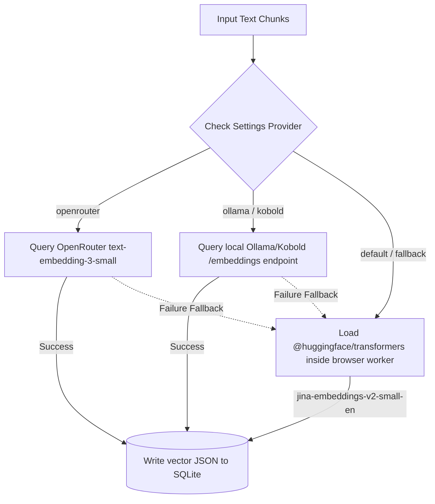
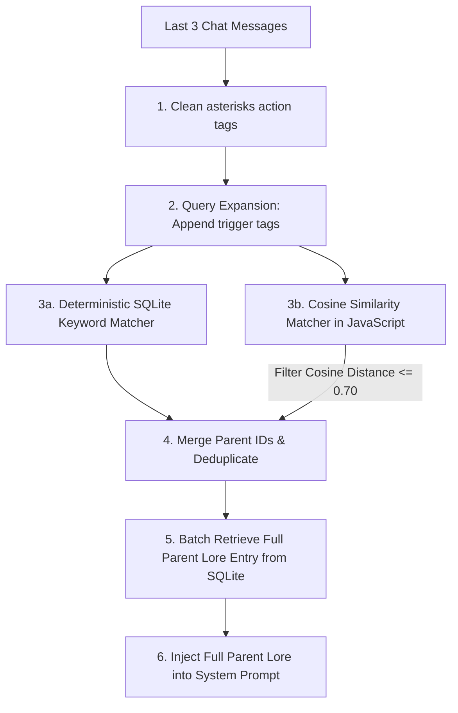

# 🧠 Smart Memory & Semantic RAG Engine

Mignon UI solves the problem of local context limits and hardware VRAM exhaustion by combining an asynchronous, milestone-aware **Smart Memory Book** with a serverless, client-side **SQLite RAG database** utilizing **Jina v2 Small** embeddings.

---

## 📜 Smart Memory Book

Instead of feeding thousands of historical chat logs directly into the LLM context (which balloons prompt evaluation latency), Mignon UI runs an asynchronous background summarization trigger inside the [api.js](../src/services/api.js) service layer.

### The Distillation Pipeline:
1. **Turn Counters**: The system monitors the quantity of unsummarized dialogue turns in each active room.
2. **15-Turn Milestone Check**: When exactly **15 unsummarized turns** occur, a background promise is launched.
3. **Dialogue Compiling**: The compiler fetches the 15 unsummarized turns and formats them into a clean, raw dialogue script.
4. **Clinical Summary Generation**: The backend triggers the active LLM with a highly optimized, objective prompt. The LLM compresses the script into a **dense, third-person narrative chapter under 100 words** detailing key events, physical movements, active moods, and milestone transformations.
5. **Database Syncing**: The chapter summary is saved as a `chat_summaries` record in SQLite and simultaneously vectorized and indexed in the `embeddings` table.

---

## 🗄️ SQLite Vector RAG Store

All vector indices, similarity queries, and cosine distance filters are coordinated inside [rag.js](../src/services/rag.js).

### Multi-Tiered Embedding Pipeline
The system utilizes a 3-tiered fallback pipeline to generate 512-dimension vector representations for text:



1. **OpenRouter API:** Queries `openai/text-embedding-3-small` in the cloud.
2. **Local API Offload:** Queries Ollama or Kobold.cpp embedding endpoints.
3. **Client-side WASM Fallback:** Loads the state-of-the-art `jina-embeddings-v2-small-en` (65 MB footprint) directly on the local CPU via HuggingFace WebAssembly transformers. This avoids binary dependencies and runs fully offline.

---

## 🔍 Hybrid RAG Context Retrieval

When compiling the prompt context, the system queries the active world lore entries in [promptCompiler.js](../src/services/promptCompiler.js) via a hybrid search engine:



### Calibration Cutoffs
To prevent "hallucinated context" or irrelevant noise, cosine distance filters (defined as $1.0 - \text{Similarity}$) are calibrated:
* **Distance $\le 0.47$**: Extremely tight semantic match (high relevance).
* **Distance $0.48 - 0.69$**: Generic topical match.
* **Distance $\ge 0.70$**: Excluded as noise (not retrieved).

---

## ⚡ KV Prefix Caching Optimization

Processing system prompts with large history matrices can cause generation delays (Time-to-First-Token lag) on standard consumer hardware. Mignon UI solves this by enforcing strict **Prefix Caching Layouts** inside [promptCompiler.js](../src/services/promptCompiler.js).

Prefix caching allows LLM engines (like Kobold.cpp or Ollama) to lock compiled key-value pairs in memory as long as the prompt prefix remains identical.

### Prompt Assembly Layout
Mignon UI divides prompts into three blocks:

```
┌──────────────────────────────────────────────────────────┐
│ 1. STATIC PREFIX (100% Cacheable)                        │
│    - System Template rules                               │
│    - Selected Character Profile                          │
│    - Global Room Setting scenarios                       │
│    - Roster of other Room Members                        │
│    - User Persona description                            │
├──────────────────────────────────────────────────────────┤
│ 2. SEMI-STATIC MIDDLE (Intermittent Cache Hits)          │
│    - Retrieved Lore Entries (updates when topics change) │
│    - Retrieved Episodic Memories (updates on summaries)  │
├──────────────────────────────────────────────────────────┤
│ 3. DYNAMIC SUFFIX (Invalidates Cache at Bottom)          │
│    - SQLite Active Room Scene Board (location, actions)  │
│    - Immediate Private Motivations                       │
│    - Final instruction directives                        │
└──────────────────────────────────────────────────────────┘
```

> [!IMPORTANT]
> By placing dynamic variables (like the Scene board status and character motivations) at the **absolute bottom** of the system prompt and maintaining static details at the top, the LLM engine's `SmartContext` can retain up to **90% of the KV cache** across consecutive turns. This reduces prompt evaluation speeds from 5-10 seconds down to **less than 150 milliseconds**!
