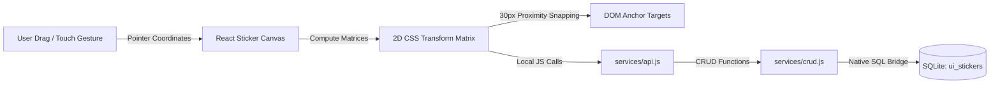

# 🖼️ Snapping Decals Canvas Overlay

Mignon UI features a customizable, gamified user interface layer: the **Interactive Decals Canvas**. This allows players to upload custom transparent PNG assets, place them as stickers anywhere over the application interface, scale them, rotate them, adjust their transparency, and snap them to specific sidebars or dialogue panels.

---

## 🎨 Viewport Overlay Architecture

The decals canvas operates as an absolute-positioned React viewport overlay managed inside [UIStickerCanvas.jsx](../src/components/UIStickers/UIStickerCanvas.jsx).



---

## ⚙️ Physics & Transformation Matrices

Each decal operates on a hardware-accelerated CSS 2D transformation matrix computed in React state and applied to the sticker wrapper element:

$$\text{transform} = \text{translate}(x, y) \times \text{scale}(s) \times \text{rotate}(\theta\text{ deg})$$

### CSS Representation:
```css
.sticker-element {
    position: absolute;
    transform: translate(var(--x), var(--y)) scale(var(--s)) rotate(var(--theta));
    opacity: var(--alpha);
    pointer-events: auto;
}
```

### Decal Parameter Ceiling Bounds:

#### 1. Pointer Coordinates ($x, y$)
* **Tracking**: Tracked as viewport percentage floats or raw pixel offsets relative to the main workspace container.
* **Events**: Listens to custom mouse `mousemove` and touch `touchmove` pointer events to map drags seamlessly.

#### 2. Pinch-Scaling factors ($s$)
* **Bounds**: $0.2 \times$ (miniature icons) up to $4.0 \times$ (fullscreen visual effects).
* **Control**: Modifiable via standard mouse-wheel scroll inputs or two-finger touch pinch gestures.

#### 3. Rotational Angles ($\theta$)
* **Bounds**: $0^{\circ} - 360^{\circ}$ degree circles.
* **Control**: Rotatable in real-time via custom bounding corner rotation handles.

#### 4. Transparency Coefficients ($\alpha$)
* **Bounds**: $0.1$ (faded watermark borders) up to $1.0$ (completely solid details).
* **Purpose**: Prevents placed decals from obstructing readable dialogues or action buttons.

---

## 🧲 Snapping Anchor Engine

To integrate stickers cleanly with dynamic application layouts rather than floating loosely, Mignon UI implements a client-side **Target Element Snapping Engine**:

1. **Selector Array Assignment**: Each decal can store a comma-separated list of CSS selector anchors (e.g. `.chat-sidebar, .message-bubble-bot, .avatar-frame`).
2. **Proximity Calculation**: During a drag, the engine queries matching elements in the DOM and fetches their layout boundaries via `getBoundingClientRect()`.
3. **30px Snapping Threshold**: If the decal coordinate falls within a **30px radius** of a matching element's border coordinates, the physics engine overrides the pointer position to snap perfectly to the target border.
4. **Layout Preservation**: Snapped stickers maintain their relative positions when the sidebar is toggled or when the viewport shifts size.

---

## 💾 Database State Persistence

All sticker coordinates are persisted instantly to the local SQLite database using JS CRUD brokers communicating through Tauri:

### 1. `api.fetchStickers()` (delegated to `crud.getStickers()`)
* **Purpose**: Fetches all active stickers on application startup from the `ui_stickers` SQLite table.
* **Returns**: An array of sticker configuration objects containing the sticker ID, Base64 image data, scale, rotation, opacity, coordinates, and CSS targets.

### 2. `api.createSticker(stickerData)` (delegated to `crud.createSticker(...)`)
* **Purpose**: Spawns and saves a new decal with a random UUID, default size, placement coordinates, and selector details.

### 3. `api.updateSticker(id, stickerData)` (delegated to `crud.updateSticker(...)`)
* **Purpose**: Updates the coordinates (`x`, `y`), scale, rotation, opacity, or element selector mappings of an existing sticker in the `ui_stickers` SQLite table.

### 4. `api.deleteSticker(id)` (delegated to `crud.deleteSticker(...)`)
* **Purpose**: Wipes the decal off the screen canvas and deletes its record from the SQLite database.
